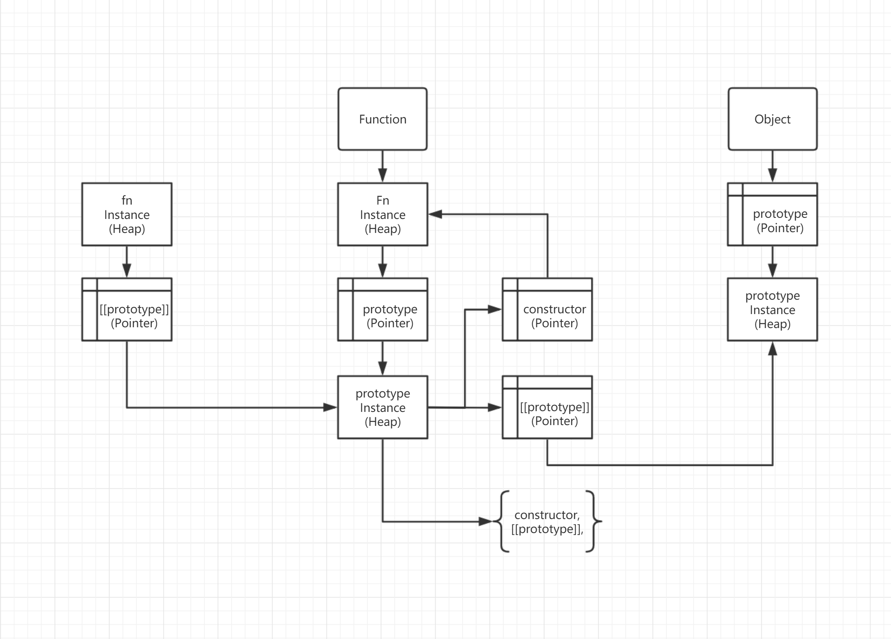

### 原型 继承 原型链
JavaScript 常被描述为一种基于原型的语言 (prototype-based language)——每个对象拥有一个原型对象，
对象以其原型为模板、从原型继承方法和属性。原型对象也可能拥有原型，并从中继承方法和属性，一层一层、以此
类推。这种关系常被称为**原型链 (prototype chain)**，它解释了为何一个对象会拥有定义在其他对象中的
属性和方法。

函数是由Object派生的类型，所以默认情况下，任何函数的原型对象 [[prototype]] 都是 Object.prototype。

如下所示，使用new操作符时，fn是fnInstance实例对象的构造函数，fnInstance的[[prototype]]属性，
是指向fn.prototype的指针。

为什么fn没有[[prototype]]属性？因为fn是一个构造函数。如Array、Number、String等JavaScript的
内置类型，他们都被视为构造函数。

所有实例对象（fnInstance）都存在[[prototype]]属性，原型对象（fnInstanceProto）也不例外，因为
原型也是实例对象。原型对象的[[prototype]]指向该实例对象（fnInstance）构造函数原型（fn.prototype）
的[[prototype]]

```javascript
function fn() {}

// 原型对象内部结构
// fn.prototype = {
//   constructor: fn,
//   [[prototype]]: Object.prototype,
// }

fn.prototype.constructor === fn;
fn.prototype[[prototype]] === Object.prototype;

const fnInstance = new fn();

const fnInstanceProto = Object.getPrototypeOf(fnInstance);
```




准确地说，这些属性和方法定义在Object的构造器函数(constructor functions)之上的prototype属性上，
而非对象实例本身。

在传统的 OOP 中，首先定义“类”，此后创建对象实例时，类中定义的所有属性和方法都被复制到实例中。在 
JavaScript 中并不如此复制——而是在对象实例和它的构造器之间建立一个链接（它是__proto__属性，是从构
造函数的prototype属性派生的），之后通过上溯原型链，在构造器中找到这些属性和方法。

注意: 理解对象的原型（可以通过Object.getPrototypeOf(obj)或者已被弃用的__proto__属性获得）与构
造函数的prototype属性之间的区别是很重要的。前者是每个实例上都有的属性，后者是构造函数的属性。也就是
说，Object.getPrototypeOf(new Foobar())和Foobar.prototype指向着同一个对象。

JavaScript是基于原型的语言，通过原型实现继承，ES6中出现的class关键字只是一个语法糖。

JavaScript中，每个实例对象都存在一个私有属性（\_\_proto__）指向它的构造函数的原型对象（prototype），
这个原型对象也存在自己的原型对象（\_\_proto__）
- 原型是一个对象

### 闭包 词法（动态）作用域 静态作用域
一个函数和对其周围状态（lexical environment，词法环境）的引用捆绑在一起（或者说函数被引用包围），
这样的组合就是闭包（closure）。也就是说，闭包让你可以在一个内层函数中访问到其外层函数的作用域。在 
JavaScript 中，每当创建一个函数，闭包就会在函数创建的同时被创建出来。

以下这个词法作用域的例子描述了分析器如何在函数嵌套的情况下解析变量名。词法（lexical）一词指的是，
词法作用域根据源代码中声明变量的位置来确定该变量在何处可用。嵌套函数可访问声明于它们外部作用域的变量。

```javascript
function init() {
    var name = "Mozilla"; // name 是一个被 init 创建的局部变量
    function displayName() { // displayName() 是内部函数，一个闭包
        alert(name); // 使用了父函数中声明的变量
    }
    displayName();
}
init();
```

如何将以下代码问题修正

```javascript
function showHelp(help) {
  document.getElementById('help').innerHTML = help;
}

function setupHelp() {
  document.body.innerHTML = `
  <p id="help">Helpful notes will appear here</p>
  <p>E-mail: <input type="text" id="email" name="email"></p>
  <p>Name: <input type="text" id="name" name="name"></p>
  <p>Age: <input type="text" id="age" name="age"></p>
  `;

  var helpText = [
      {'id': 'email', 'help': 'Your e-mail address'},
      {'id': 'name', 'help': 'Your full name'},
      {'id': 'age', 'help': 'Your age (you must be over 16)'}
    ];

  for (var i = 0; i < helpText.length; i++) {
    var item = helpText[i];
    document.getElementById(item.id).onfocus = function() {
      showHelp(item.help);
    }
  }
}

setupHelp();
```

- 解1：
```javascript
function showHelp(help) {
  document.getElementById('help').innerHTML = help;
}

function setupHelp() {
  document.body.innerHTML = `
  <p id="help">Helpful notes will appear here</p>
  <p>E-mail: <input type="text" id="email" name="email"></p>
  <p>Name: <input type="text" id="name" name="name"></p>
  <p>Age: <input type="text" id="age" name="age"></p>
  `;

  var helpText = [
      {'id': 'email', 'help': 'Your e-mail address'},
      {'id': 'name', 'help': 'Your full name'},
      {'id': 'age', 'help': 'Your age (you must be over 16)'}
    ];

  for (var i = 0; i < helpText.length; i++) {
    let item = helpText[i];
    document.getElementById(item.id).onfocus = function() {
      showHelp(item.help);
    }
  }
}

setupHelp();
```

- 解2：
```javascript
function showHelp(help) {
  document.getElementById('help').innerHTML = help;
}

function cb(item) {
  return function () {
    showHelp(item.help);
  }
}

function setupHelp() {
  document.body.innerHTML = `
  <p id="help">Helpful notes will appear here</p>
  <p>E-mail: <input type="text" id="email" name="email"></p>
  <p>Name: <input type="text" id="name" name="name"></p>
  <p>Age: <input type="text" id="age" name="age"></p>
  `;

  var helpText = [
      {'id': 'email', 'help': 'Your e-mail address'},
      {'id': 'name', 'help': 'Your full name'},
      {'id': 'age', 'help': 'Your age (you must be over 16)'}
    ];

  for (var i = 0; i < helpText.length; i++) {
    var item = helpText[i];
    document.getElementById(item.id).onfocus = cb(item);
  }
}

setupHelp();
```

### 变量对象 作用域链 执行上下文 This

当 JavaScript 代码执行一段可执行代码(executable code)时，会创建对应的执行上下文(execution context)。

对于每个执行上下文，都有三个重要属性：

- 变量对象(Variable object，VO)
- 作用域链(Scope chain)
- this
今天重点讲讲创建变量对象的过程。

```javascript
var scope = "global scope";
function checkscope(){
    var scope = "local scope";
    function f(){
        return scope;
    }
    return f();
}
checkscope();
var scope = "global scope";
function checkscope(){
    var scope = "local scope";
    function f(){
        return scope;
    }
    return f;
}
checkscope()();
```

让我们模拟第一段代码：

```text
ECStack.push(<checkscope> functionContext);
ECStack.push(<f> functionContext);
ECStack.pop();
ECStack.pop();
```

让我们模拟第二段代码：

```text
ECStack.push(<checkscope> functionContext);
ECStack.pop();
ECStack.push(<f> functionContext);
ECStack.pop();
```

以下代码输出什么？为什么？
```javascript
const fn1 = function fn2() {}
console.log(fn1, fn2);
```

### 执行上下文类型：
- ### 全局执行上下文
- ### 函数执行上下文
- ### Eval执行上下文
