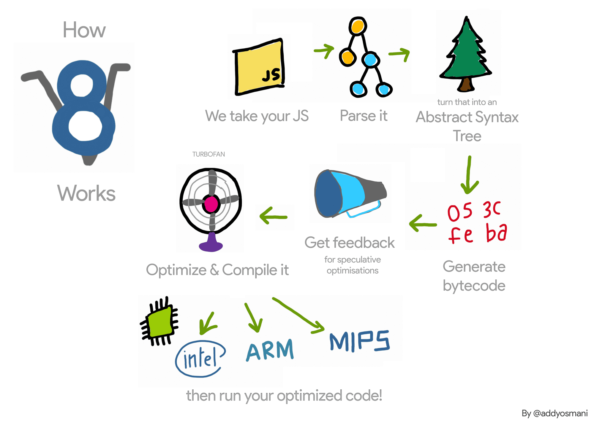
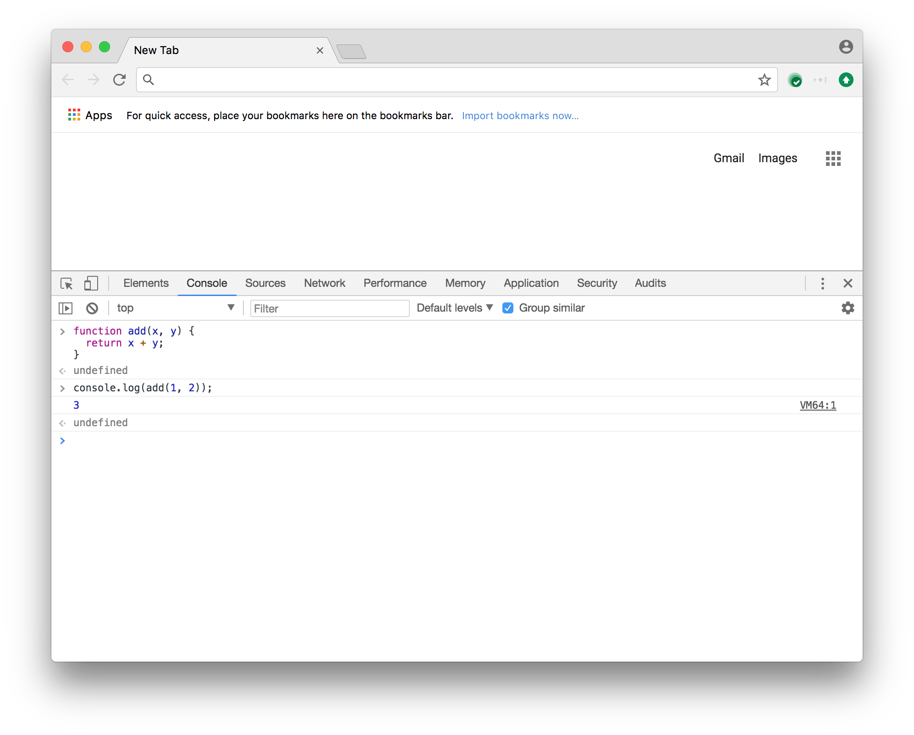
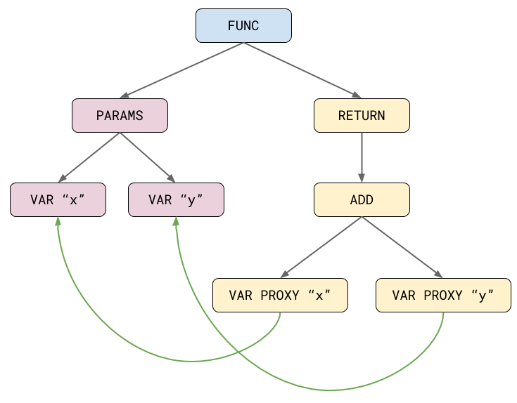
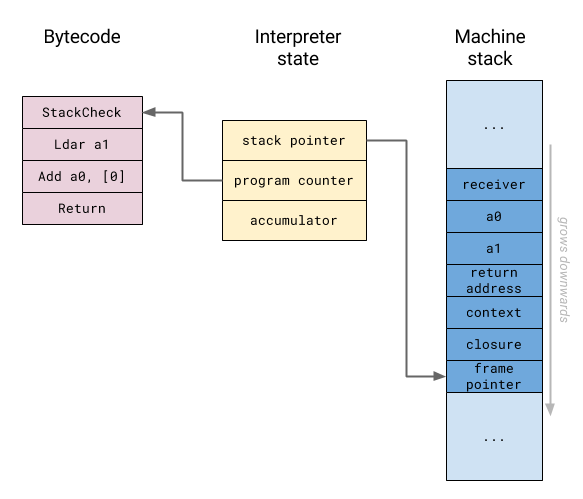
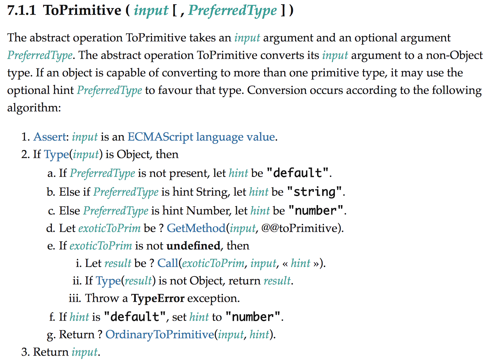
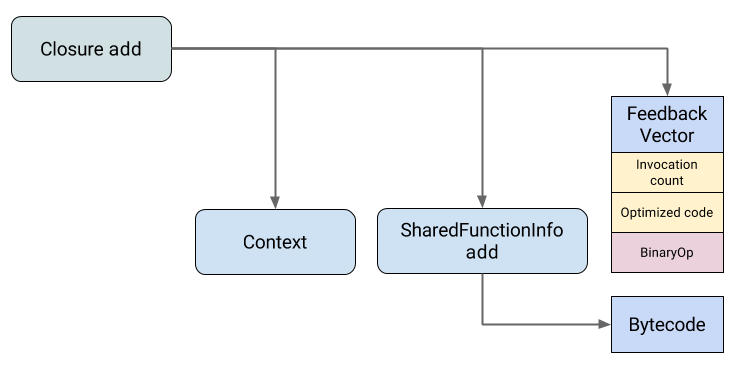

我们希望写一篇引人入胜的入门级文章，希望您对V8进行优化时有一个很好的了解。

在JS Kongress上我的演讲“ Turbo Tan的故事”（幻灯片）之后，我想提供一些其他上下文，介绍V8的优化编译器TurboFan如何工作以及V8如何将JavaScript变成高度优化的机器代码。对于演讲，我必须简短，并省略一些细节。因此，我将利用这次机会来填补空白，尤其是V8如何收集和使用概要分析信息来执行推测性优化。

## 概述

在深入探讨TurboFan的工作原理之前，我将会简单解释V8是如何在上层工作的。让我们看一下V8的简化细分（摘自我的同事Addy Osmani的“ JavaScript Start-up Performance”博客文章）：


每当Chrome或Node.js执行一段JavaScript时，它将源代码传递给V8。V8接收该JavaScript源代码并将其提供给所谓的Parser，后者为您的源代码创建一个抽象语法树（AST）的描述。然后将AST传递到Ignition解释器上，在该解释器上将其转换为字节码序列。然后，该字节码序列由Ignition执行。

在执行期间，Ignition收集有关某些操作输入的分析信息或反馈。其中一些反馈被Ignition本身用于加速后续字节码的解释。举个例子，对于像o.x这样的属性访问，其中o始终具有相同的形状，（这里指o的结构是以{k:v}表示，并且v的类型为字符串），我们会缓存关于如何获取x的值的信息。在后续执行相同的字节码时，我们不需要再次在o中查找x。这一底层机制被称为内联缓存（IC）。

取决于您的工作负载，也许更重要的是由Ignition解释器收集的反馈被TurboFan编译器使用一种被称为推测优化（Speculative Optimization）的技术生成高度优化的机器码。在这里，优化编译器将查看过去看到的是什么样的值，并假设未来我们将看到同样的值。这使TurboFan可以省去很多不需要处理的情况，这对于以最佳性能执行JavaScript极为重要。

## 基本执行管道

让我们考虑我在演讲中示例的简化版，仅关注add功能以及V8如何执行该功能。

```javascript
function add(x, y) {
    return x + y;
}

console.log(add(1, 2));
```

如果您在如果您在Chrome DevTools的控制台中运行此命令，则会看到它输出了预期的结果3：



让我们看看在V8引擎下发生了什么，以便获得实际的结果。我们将逐步执行add函数。正如上面所提到的那样，我们首先需要解析函数源码并将其转换为抽象语法树（AST），这是由解析器去完成的。您可以在d8 shell的调试构建中输入--print-ast参数看到V8内部生成的AST。

```
$ out/Debug/d8 --print-ast add.js
--- AST ---
FUNC at 12
  KIND 0
  SUSPEND COUNT 0
  NAME "add"
  PARAMS
    VAR (0x7fbd5e818210) (mode = VAR) "x"
    VAR (0x7fbd5e818240) (mode = VAR) "y"
  RETURN at 23
    ADD at 32
      VAR PROXY parameter[0] (0x7fbd5e818210) (mode = VAR) "x"
      VAR PROXY parameter[1] (0x7fbd5e818240) (mode = VAR) "y"
```

这种格式不太易用，所以让我们将它可视化。



最初，add函数字面量被解析为一个树形的表达，其中一个子树用于参数声明，一个子树用于实际函数体。在解析过程中，很难分辨出哪个名称对应于程序中的哪些变量，这主要是由于JavaScript中有趣的var提升和eval，但也有其他原因。因此，对于每个名称，解析器最初都会创建所谓的VAR代理（VAR PROXY）节点。随后的作用域解析步骤将这些VAR代理节点连接到声明的VAR节点，或将它们标记为全局或动态查找，这取决于解析器是否在周围的其中任一作用域中看到了eval表达式。

完成此操作后，我们就有了一个完整的AST，其中包含从中生成可执行字节码的所有必要信息。然后，将AST传递给字节码生成器（BytecodeGenerator），节码生成器是Ignition解释器的一部分，它基于每个函数生成字节码。您还可以看到--print-bytecode带有标记d8（或带有node）的V8由V8生成的字节码。您还可以在d8 shell（或是nodejs）中看到v8使用--print-bytecode参数生成的字节码

```
$ out/Debug/d8 --print-bytecode add.js
[generated bytecode for function: add]
Parameter count 3
Frame size 0
   12 E> 0x37738712a02a @    0 : 94                StackCheck
   23 S> 0x37738712a02b @    1 : 1d 02             Ldar a1
   32 E> 0x37738712a02d @    3 : 29 03 00          Add a0, [0]
   36 S> 0x37738712a030 @    6 : 98                Return
Constant pool (size = 0)
Handler Table (size = 16)
```

这表示为add函数生成了一个新的字节码对象，它接受三个参数：隐式参数this，以及显式参数x和y。该函数不需要任何局部变量（帧大小为零），并且包含四个字节码的序列：

```
StackCheck
Ldar a1
Add a0, [0]
Return
```

为了解释这一点，我们首先需要了解解释器是如何在上层工作的。Ignition使用所谓的寄存器机（与FullCodegen编译器中早期V8版本使用的堆栈机方法不同）。它将其本地状态保存在解释器寄存器中，其中一些映射到实际的CPU寄存器，而另一些则映射到本机栈内存中的特定插槽。



特殊寄存器a0和a1对应于堆栈机器上函数的形参（在本例中，我们有两个形参）。形参是源代码中声明的参数，可能与运行时传递给函数的实参不同。每个字节码的最后计算值通常保存在称为累加器（accumulator）的特殊寄存器中，当前栈帧或激活记录由栈指针标识，并且程序计数器指向字节码中当前执行的指令。让我们检查一下本例中各个字节码都做了些什么：

- StackCheck将堆栈指针与某个已知的上限（实际上是一个下限，因为在V8支持的所有体系结构上，堆栈向下增长）。如果堆栈增长到某个阈值以上，我们将中止函数的执行，并抛出一个RangeError，表示堆栈已溢出。
- Ldar（LoaD Accumulator Register） a1将寄存器a1的值加载到累加寄存器。
- Add a0，从a0寄存器中加载[0]的值，并将其添加到累加寄存器中。结果被再次放入累加寄存器。请注意，这里的加法也可以表示字符串串联，并且此操作可以根据操作数执行任意JavaScript。JavaScript中的+运算符非常复杂，许多人都试图在讨论中说明其复杂性。Emily Freeman最近在JS Kongress上做了一个演讲，题目是“JavaScript的”+“操作符和决策疲劳”（JavaScript’s “+” Operator and Decision Fatigue），正是关于这个话题。Add运算符的[0]操作数引用了一个反馈向量槽，在该槽中，Ignition存储了有关在函数执行期间看到的值的分析信息。稍后我们将在研究TurboFan如何优化函数时再次回到这。
- Return结束当前函数的执行，并将控制权转交给调用者。返回的值是累加寄存器中的当前值。

## 推测优化

现在您大致已经了解了V8在基准情况下是如何执行JavaScript的，现在是时候开始研究TurboFan是如何适应这种情况的，以及它如何将JavaScript代码转换为高度优化的机器代码。+运算符在JavaScript中已经是一个非常复杂的操作，在它最终对输入进行数字相加之前，它必须进行大量的检查。

[+运算符的运行时语义]

仅仅在几条机器指令中就可以实现峰值性能（与Java/C++相媲美），这里的神奇之处就是推测优化，它通过假设可能的输入。例如，当我们知道在x+y的情况下，x和y都是数字时，我们不需要处理其中任何一个都是字符串的情况或是更糟的情况--操作数可以是任意的JavaScript对象，我们需要首先对其运行抽象操作ToPrimitive。




知道x和y都是数字也意味着我们可以排除可观察到的副作用-例如，我们知道它不能关闭计算机、写入文件或导航到不同的页面。此外，我们知道该操作不会引发异常。这两个对于优化都很重要，因为优化编译器只有在确定表达式不会引起任何可观察的副作用并且不会引发异常的情况下才能消除表达式。
